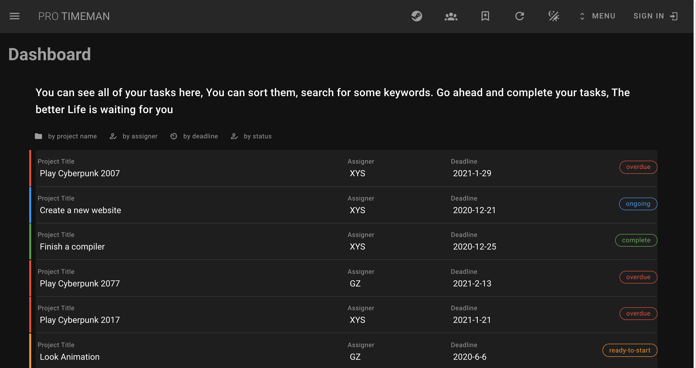

# TimeMan

techniques:

- Vue 2.x
- Java14
- Vuetify
- MySQL 8
- Spring Boot 2.4

 An educational purpose project, aimed to learn Java Spring Boot to develop back end and vue with vuetify to develop front end.

 You could run front end via yarn install and yarn serve

 You could run back end via maven

 However, this project is working in progress and only for software engineering class's homework. It still need lots of work to implements its functionality

This project is a prototype web app to manage someone’s time focus on campus. where teachers and students can send task to each other.

As this is an only **toy** project, in the back end no authentication, no validation is provided, all HTTP requsts written in correct form will be accepted and executed by back end, and lots of code write only for learning purpose or just test the backend. so just take this toy project as a toy to play with, finding code that may be meaningless, just let it go.

It’s **archived**

## Snapshots

- Dashboard
- 
- Sign In
- 
- Query Tasks By ...
- 
- See your teams. the number and the color of icon denotes your remained tasks
- 

- See your team task and member statistics
- 
- 

this readme is also available in [简体中文](./readme_zh.md)

